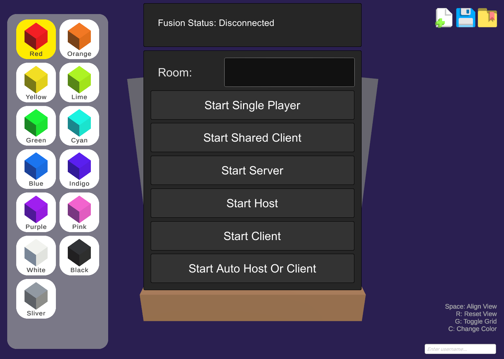

# CubbleWorld 🎲

### 프로젝트 개요  
CubbleWorld는 Unity 기반의 미니 큐브 크래프트 프로젝트로, 사용자가 간단한 창작물을 실시간 제작·공유할 수 있도록 설계되었습니다. UI 심화, 데이터 직렬화, 멀티플레이 네트워킹, 에디터 확장까지 Unity 개발 전반을 아우르는 XREAL 6기 데브 학습용 레퍼런스 프로젝트입니다.

 

## 🛠️ 구현 기능  

### **1. UI & 워크플로 아키텍처**
- Factory Pattern + Prefab 카탈로그: 오브젝트 생성 구조를 유연하게 추상화
- 실시간 블록 미리보기: RenderTexture + Shader 조합으로 에디터 내 즉시 피드백
- Editor 전용 확장: MenuItem, CustomEditor, PropertyDrawer 활용

### **2. 데이터 직렬화**
- **동적 데이터**와 **정적 데이터**의 관리 구조  
- ScriptableObject를 활용한 데이터 관리  
- SO List 패턴 구현 및 **Prefab과의 연동**  
- **JSON**을 통한 데이터 직렬화 및 입출력(IO) 기능  

### **3. 네트워킹 및 멀티플레이어 기능**
- **Photon Fusion**을 활용한 네트워크 멀티플레이어 구현  
- **NetworkObject** 및 **NetworkTransform** 동기화  
- RPC(Remote Procedure Call)를 활용한 **동기화 최적화**  
- 네트워크 직렬화 및 동기화 데이터 처리  

### **4. Unity Editor 스크립트**
- Custom **Editor Script**를 통한 작업 자동화  
- **MenuItem**을 활용한 편리한 에디터 확장  
- ScriptableObject, Prefab, 어셋 자동 관리  
- **CustomEditor** 및 **PropertyDrawer** 구현  
- 에디터 전용 창(Window) UI 개발  

 

## 💡 사용 기술 스택
- **Unity 2022.3 LTS**  
- **Photon Fusion**  
- **C#**    
- **Shader Graph**  

 

### 초기 화면

### 플레이 화면

 
